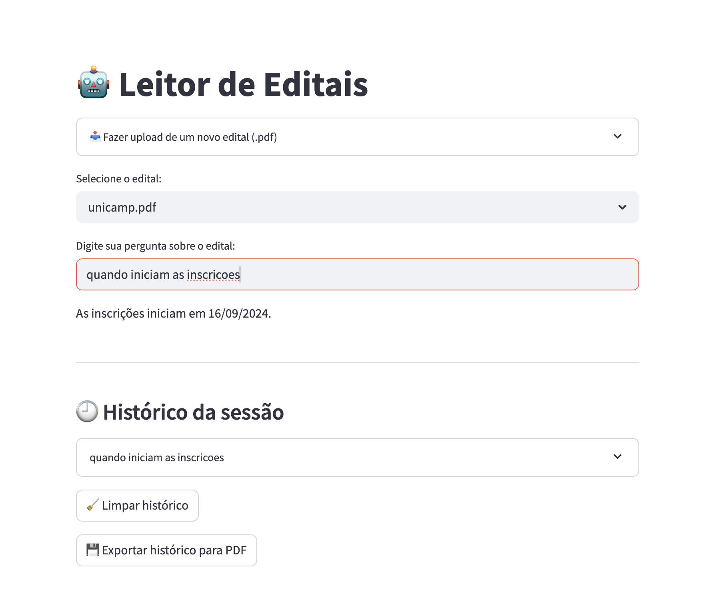
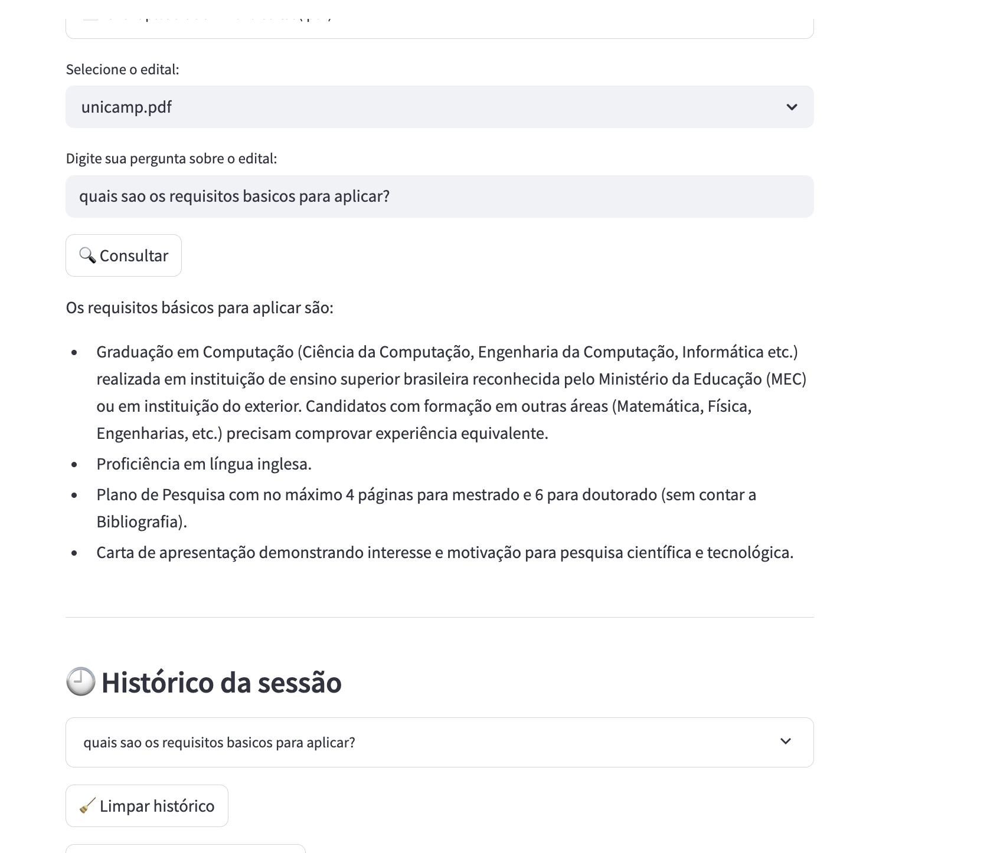
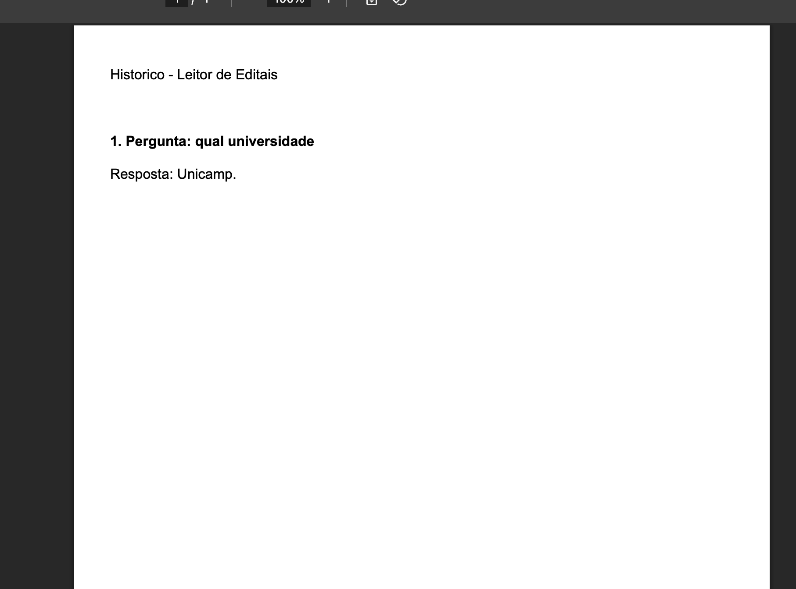

# 🤖 Chat dos Editais

Este é um projeto de IA que utiliza **RAG (Retrieval-Augmented Generation)** para responder perguntas sobre editais em arquivos PDF. Inicialmente feito para ler o edital do **Mestrado da USP**, agora com suporte para ler qualquer edital PDF.

Você pode escolher entre os modelos **Gemini 1.5 Pro (gratuito via MakerSuite)** ou **OpenAI GPT-3.5/GPT-4** para processar perguntas e gerar respostas inteligentes, tudo por meio de uma interface simples feita com **Streamlit**.


---

## 🧠 O que este projeto faz

- Permite fazer perguntas sobre qualquer edital em PDF
- Utiliza RAG: busca trechos relevantes no documento e envia para um modelo LLM (Gemini ou OpenAI)
- Suporte a múltiplos PDFs e histórico de perguntas
- Interface web simples e intuitiva com Streamlit
- Permite exportar o histórico de perguntas/respostas em PDF
- Gera respostas em **português**, com base no conteúdo real do edital

---

## Imagens do projeto rodando





## ⚙️ Tecnologias usadas

- [LangChain](https://www.langchain.com/)
- [Gemini 1.5 Pro via MakerSuite](https://makersuite.google.com/app/apikey)
- [OpenAI API](https://platform.openai.com/account/api-keys)
- [FAISS](https://github.com/facebookresearch/faiss)
- [Streamlit](https://streamlit.io/)
- [Python 3.10+](https://www.python.org/)

---

## 🔐 Como obter sua da API

### Gemini 1.5 Pro (MakerSuite)

1. Acesse: [https://makersuite.google.com/app/apikey](https://makersuite.google.com/app/apikey)
2. Clique em **"Create API Key"**
3. Copie a chave (começa com `AIza...`)
4. Crie um arquivo `.env` na raiz do projeto com o seguinte conteúdo:

```env
GOOGLE_API_KEY=AIza...sua-chave-aqui
```

### OpenAI
1. Acesse: https://platform.openai.com/account/api-keys
2. Clique em **"Create new secret key"**
3. Copie a chave (começa com `sk-...`)
4. Crie um arquivo `.env` na raiz do projeto com o seguinte conteúdo:

```env
OPENAI_API_KEY=sk...sua-chave-aqui
```

## Instalação

### Clone o repositório:

```bash
git clone https://github.com/seu-usuario/leitor-de-editais.git
cd leitor-de-editais
```

### Crie e ative o ambiente virtual:

```bash
python3 -m venv .venv
source .venv/bin/activate
```

### Instale as dependências:

```bash
pip install -r requirements.txt
```

## Executando o projeto

Este projeto já inclui um script chamado run.py que:
Gera os vetores (caso ainda não existam)
Inicia automaticamente a interface do chatbot via Streamlit

```bash
python run.py
```

## Estrutura esperada

```
.
├── app.py                  # Interface com Streamlit
├── rag_pipeline.py         # Pipeline de RAG com LangChain
├── run.py                  # Arquivo para rodar tudo com um comando
├── docs/
│   └── edital.pdf          # Seu PDF do edital
├── data/                   # Armazena vetores FAISS
├── .env                    # Contém sua API key
└── requirements.txt
```

## Limites da API gratuita Gemini (MakerSuite)

- Recurso	Limite estimado:    Requisições por dia	~60–150
- Tokens por requisição:      ~30.000
- Custo:                      Gratuito
- Autenticação necessária:    Apenas a chave da MakerSuite
- Suporte SLA / Produção:     ❌ Não garantido

## Autor
[Henrique Jensen](https://github.com/henriquejensen)